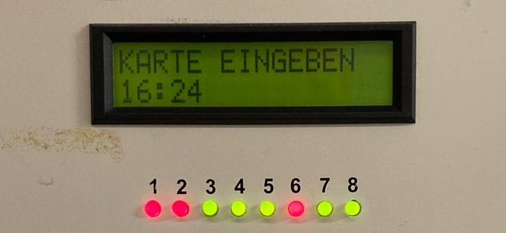

# Idea of this project

The current issue involves the inconvenience of checking washing machine availability at a pay station located next to the machines, causing frustration and wasted time, especially for residents on higher floors.

A proposed solution suggests making information on machine availability accessible online via a website, enabling users to check beforehand and streamline the laundry process, presenting a convenient and efficient resolution.

## Enhanced functions
A simple further development could display the status of all machines in real time. An advanced version of the application could provide detailed device information such as device type in addition to availability information. To further improve user-friendliness, translations could also be implemented in all the languages represented.

### The Weidedamm-Süd laundry room
Eight appliances are available in the laundry room, including four dryers and four washing machines. 
Before these can be used, payment is required at the nearby payment station. 
Information about the individual machines is also available at the payment station. 
A diode on each appliance signals activity with a green light and inactivity with a red light. 
This is a simple way for users to see which machines are currently available and which are already in use.

### What's the issue?
It's great that you can see which washing machines are free at the pay station, but the problem is that the pay station is right next to the machines.
So if you live on the fourth floor and have to go to the pay station to find out if a washing machine is free before you drag out your laundry, it can be really annoying.
You lose time and are annoyed when there isn't a free machine after all.
It would be easier if you could get the information on the way to the machines.

### What is the solution here?
To solve the problem, an effective solution could be to make information on the availability of washing machines accessible online.
Instead of going to the pay station, users could conveniently access the digitized information via a website.
This would allow residents to see which machines are available before they even go to the laundry room.
By making the information available online on the bottom floor, a simple and time-saving solution could be created that provides users with a clear overview of the availability of washing machines and dryers.